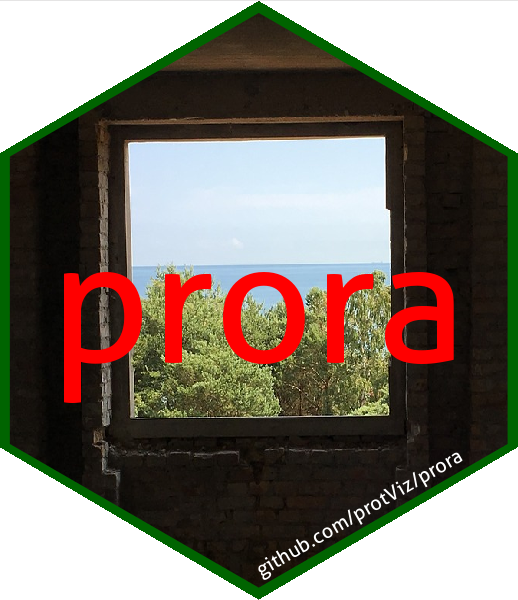

# prora

prora an R package for proteomics over representation analysis (ORA) and gene set enrichment analysis (GSEA)



For the `prora` package documentation visit `https://protviz.github.io/prora/`.

# Introduction

A plethora of R packages exist on CRAN and Bioconductor to perform over-representation 
analysis (ORA) and gene set enrichment analysis (GSEA). However, consistency in the 
underlying nomenclature for specific analyses and user friendly implementation is 
still lacking. `prora` aims at unifying ID mapping and enrichment analysis 
in a syntactically coherent and intuitive way, while ensuring reproducibility of 
results. `prora` primarily consists of wrapper functions around the 
`r BiocStyle::CRANpkg("sigora")`, `r BiocStyle::CRANpkg("WebGestaltR")` and `r BiocStyle::Biocpkg("fgsea")`  packages from CRAN and Bioconductor and `r BiocStyle::CRANpkg("rmarkdown")` based reports for visualisation and contextualisation 
of analysis results.

# Installing R package prora

To install the package in R run the following code:

```
install.packages("remotes")
remotes::install_github("protViz/prora")
```


# Webgestalt ORA

```
PS >  Rscript <fgczgseaora_path>\run_scripts\lfq_2grp_webgestalt_ora.R --help

WebGestaltR ORA

Usage:
  test.R <grp2file> [--organism=<organism>] [--outdir=<outdir>] [--log2fc=<log2fc>] [--is_greater=<is_greater>] [--nperm=<nperm>] [--ID_col=<ID_col>] [--fc_col=<fc_col>]

Options:
  -o --organism=<organism> organism [default: hsapiens]
  -r --outdir=<outdir> output directory [default: results_ora]
  -t --log2fc=<log2fc> fc threshold [default: 1]
  -g --is_greater=<is_greater> is greater than log2fc [default: TRUE]
  -n --nperm=<nperm> number of permutations to calculate enrichment scores [default: 50]
  -i --ID_col=<ID_col> Column containing the UniprotIDs [default: TopProteinName]
  -f --fc_col=<fc_col> Column containing the estimates [default: log2FC]

Arguments:
  grp2file  input file
PS D:\Dropbox\DataAnalysis\fgczgseaora_Test_SRMService_Integration>
```


Ora analysis for foldchanges greater and smaller than 1.

```
Rscript <fgczgseaora_path>\run_scripts\lfq_2grp_webgestalt_ora.R .\data\2Grp_CF_a_vs_CF_b.txt --log2fc=1 --is_greater=TRUE
Rscript <fgczgseaora_path>\run_scripts\lfq_2grp_webgestalt_ora.R .\data\2Grp_CF_a_vs_CF_b.txt --log2fc=1 --is_greater=FALSE
 
```

# WebGestaltR GSEA 

```
PS >  Rscript <fgczgseaora_path>\run_scripts\lfq_2grp_webgestalt_gsea.R --help
WebGestaltR GSEA

Usage:
  test.R <grp2file> [--organism=<organism>] [--outdir=<outdir>] [--nperm=<nperm>] [--ID_col=<ID_col>] [--fc_col=<fc_col>]

Options:
  -o --organism=<organism> organism [default: hsapiens]
  -r --outdir=<outdir> output directory [default: results_gsea]
  -n --nperm=<nperm> number of permutations to calculate enrichment scores [default: 50]
  -i --ID_col=<ID_col> Column containing the UniprotIDs [default: TopProteinName]
  -f --fc_col=<fc_col> Column containing the estimates [default: log2FC]

Arguments:
  grp2file  input file
PS D:\Dropbox\DataAnalysis\fgczgseaora_Test_SRMService_Integration>
```


```
PS > Rscript <fgczgseaora_path>\run_scripts\lfq_2grp_webgestalt_gsea.R .\data\2Grp_CF_a_vs_CF_b.txt
```

To simplify executing the scripts you can add `<fgczgseaora_path>\win` to the path variable on windows and than execute:

```
PS > lfq_2grp_webgestalt_gsea.bat --help
```

or ad `<fgczgseaora_path>\run_scripts` to the path on linux and execute

```
lfq_2grp_webgestalt_gsea.R --help
```


